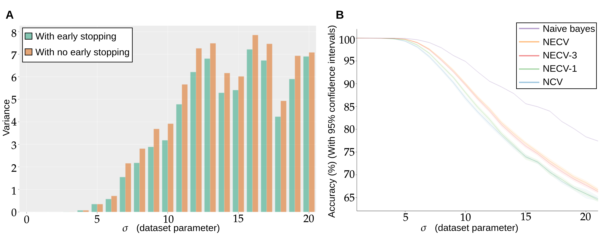
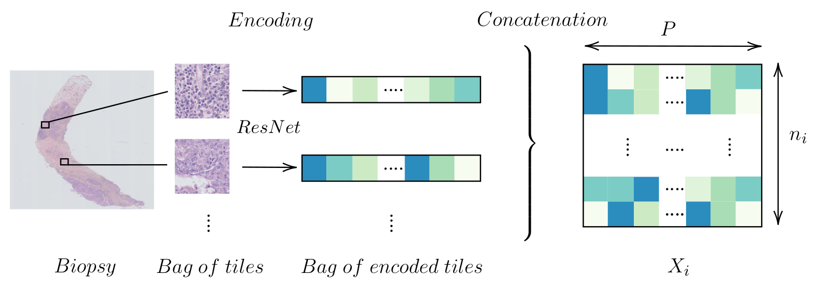

# README

This repository contains the code necessary to reproduce the work presented in "Neural network for the prediction of treatment response in TNBC" by P.Naylor, T.Lazard, G.Bataillon, M.Laé, A.Vincent-Salomon, A.Hamy, F.Reyal and T.Walter submitted in [....].

# Code structure

The code is based on nextflow which allows to submit process to a cluster scheduler in a automatic way. In particular, nextflow is smart scheduler which knows when to relaunch jobs and when to cache them.

Please check the Makefile in order to understand where and how each code is used.

## Nested Ensemble Cross Validation:

*In the above figure we show the inherent problem of disabling early stopping in small datasets. In Figure (A), we show the variance in runs where the exact same hyper-parameters and dataset are used for a given $\sigma$. In Figure (B), we show the difference in performance between using NECV where the validation makes the most out of early stopping and NCV where early stopping is disabled in the returned model.*

### Figure (A) : Variance in repeated experiment

In order to reproduce Figure (A) above, please run the following:
`make repeated_experiment`. You should find the results in the folder `results/repeated_exp`. 4 variables of interest can be easily modified in `Repeated_experiment.nf`:

- `STD_MAX`: the maximum standard error value for the data set simulation. Set to 21 in the paper.
- `DATA_REPEATS`: number of data sets per standard error to generator. Set to 10 in the paper.
- `REPEATS_PER_PROCESS` and `REPEATS_BY` are two parameters to control the parallelisation of the process. Each simulated data (i.e. each `DATA_REPEATS`) will be run `REPEATS_PER_PROCESS x REPEATS_BY`times. In particular, `REPEATS_PER_PROCESS` control the number of indepedant process to run in parallel and `REPEATS_BY` controls the number of repeats in one process.

### Figure (B) NECV vs NCV

In order to reproduce Figure (B) above, please run the following: `make necv_vs_ncv`. You should then find the results in the folder `results/necv_vs_ncv/`. 2 variables of interest can be easily modified in `NECV_VS_NCV.nf`:

- `STD_MAX`: the maximum standard error value for the data set simulation. Set to 21 in the paper.
- `REPEATS`: number of repeats for each procedure. Set to 40 in the paper.

## Triple Negative Breast Cancer:

The data used in this study is not publicly available and the TNBC results given in the paper can not be reproduced.
However most of the methods can be reproduced on your own data. Our `label.csv` file resembles the following:

| Biopsy    | RCB_class |
| ----------- | ----------- |
| Sample_001     | 0       |
| Sample_002     | 1       |
| ....                |....     |

And as you can read in the make file for procedures `encoding`, `model_2S` and `model_1S` we give a `--tiff_location` which will prepend the path and append the `.tif` extension to the biopsy name.

In particular:
### Encoding 

*Encoding a biopsy into a $n_i \times p$ matrix*

The command used is `make encoding` and the corresponding nextflow file is `nextflow/Tiling-encoding.nf`.

### Model 2S

These models based on two steps are the models that can found in the paper: *Predicting Residual Cancer Burden in a triple negative breast cancer cohort* by Peter Naylor, Joseph Boyd, Marick Laé, Fabien Reyal, Thomas Walter published in 2019 IEEE 16th International Symposium on Biomedical Imaging (ISBI 2019).

### Model 1S

The main models of the paper, to launch this pipeline please the run the follwing command: `make model_1S`.
The main architectures presented in the paper can be found in the python file `python/nn/model_definition.py`.
